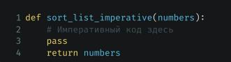
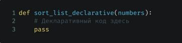

**Парадигмы программирования и языки парадигм (семинары)**  
***Урок 1. Императивное и декларативное программирование на практике***  
  
Для разогрева на первое домашнее задание будет каноническая задача сортировки списка.  
***Задача №1***  
Дан список целых чисел numbers. Необходимо написать в императивном стиле процедуру для сортировки числа в списке в порядке убывания. Можно использовать любой алгоритм сортировки.  

***Задача №2***  
Написать точно такую же процедуру, но в декларативном стиле  

