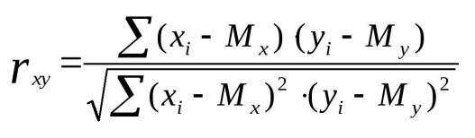

**Парадигмы программирования и языки парадигм (семинары)**  
***Урок 4. Функциональное программирование***  
Написать скрипт для расчета корреляции Пирсона между
двумя случайными величинами (двумя массивами).  
Можете использовать любую парадигму, но рекомендую использовать
функциональную, т.к. в этом примере она значительно
упростит вам жизнь.  
● Формула корреляции Пирсона:  
